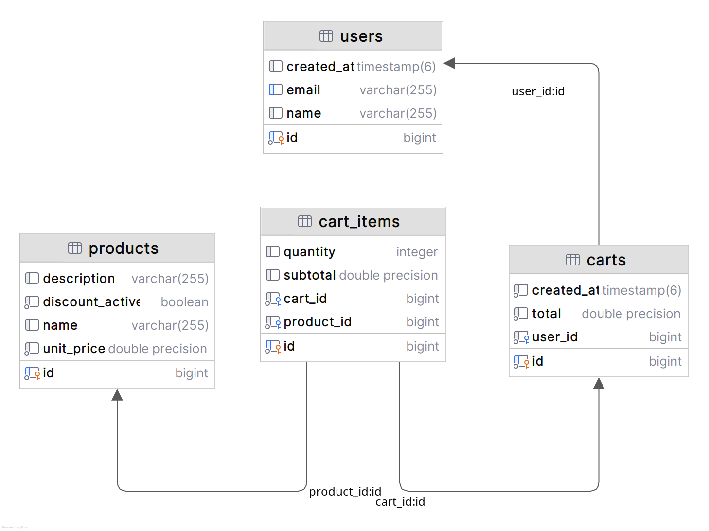

# Shopping cart | Indra challenge
Code challenge desarrollado para la posición de Java Developer en Indra

Éste documento consta de 5 secciones
- Requerimientos del sistema
- Inciar el proyecto
  - En caso de erroes
- Scripts de datos inciales
- Documentación 
  - MER
  - Postman
  - APIS
- Tests

# Requerimientos del Sistema
Para ejecutar este proyecto, asegúrate de tener los siguientes requisitos instalados y configurados en tu sistema:

#### 1. Java 17 o superior

#### 2. Apache Maven 3.8 o superior

#### 3. PostgreSQL 12 o superior
- **Configuración Requerida**:
    - Crea una base de datos para el proyecto:
      ```sql
      CREATE DATABASE shopping_cart_db;
      ```
    - Configura el archivo `application.properties` con tus credenciales de PostgreSQL:
      ```properties
      spring.datasource.url=jdbc:postgresql://localhost:5432/shopping_cart_db
      spring.datasource.username=tu_usuario
      spring.datasource.password=tu_contraseña
      ```
# 1. Iniciar el proyecto
Para ejecutar este proyecto ejecutar alguno de los siguientes comandos en la raiz del proyecto:

Opcion 1 con maven:
```sql
mvn spring-boot:run;
```
Opción 2 generando el jar
```sql
java -jar target/shopping-cart-0.0.1-SNAPSHOT.jar
```
Ir al navegador web
```sql
http://localhost:8080/swagger-ui.html
```

## 1.1. En caso de errores
### Error por puerto 8080 ocupado
En caso de tener ocupado el puerto 8080 debe configurar otro en el archivo application.properties
```sql
# application.properties
server.port=PUERTO_LIBRE
```
### Error generación automática de tablas
El sistema generará automáticamente las tablas del aplicativo en la base de datos configurada en los properties del aplicativo, si presenta problemas comentar ésta linea y ejecutar los scripts de creación de tablas (remplace sail por su usuario )
```sql
# application.properties
# spring.jpa.hibernate.ddl-auto=update
```

```sql
-- Crear tabla de usuarios
create table if not exists public.users
(
  id         bigint generated by default as identity
  primary key,
  created_at timestamp(6),
  email      varchar(255)
  constraint uk6dotkott2kjsp8vw4d0m25fb7
  unique,
  name       varchar(255)
  );

alter table public.users
  owner to sail;

-- Table: products
create table if not exists public.products
(
  id              bigint generated by default as identity
  primary key,
  description     varchar(255),
  discount_active boolean          not null,
  name            varchar(255),
  unit_price      double precision not null
  );

alter table public.products
  owner to sail;

-- Crear tabla de carritos
create table if not exists public.carts
(
  id         bigint generated by default as identity
  primary key,
  created_at timestamp(6)     not null,
  total      double precision not null,
  user_id    bigint           not null
  constraint fkb5o626f86h46m4s7ms6ginnop
  references public.users
  );

alter table public.carts
  owner to sail;

-- Crear tabla de items del carrito
create table if not exists public.cart_items
(
  id         bigint generated by default as identity
  primary key,
  quantity   integer,
  subtotal   double precision,
  cart_id    bigint not null
  constraint fkpcttvuq4mxppo8sxggjtn5i2c
  references public.carts,
  product_id bigint not null
  constraint fk1re40cjegsfvw58xrkdp6bac6
  references public.products
);

alter table public.cart_items
  owner to sail;

--cupones
create table if not exists public.coupons
(
  id         bigint generated by default as identity
  primary key,
  code       varchar(255)     not null
  constraint ukeplt0kkm9yf2of2lnx6c1oy9b
  unique,
  discount   double precision not null,
  end_date   date             not null,
  start_date date             not null,
  used       boolean          not null
  );

alter table public.coupons
  owner to sail;

```
## 2. Scripts de Datos Iniciales

Para poblar la base de datos con datos iniciales, puedes ejecutar los siguientes scripts SQL en PostgreSQL:

```sql
-- Insertar usuarios
INSERT INTO users (id, name, email, created_at) VALUES
(1, 'Carlos', 'carlos@example.com', NOW()),
(2, 'Ernesto', 'ernesto@example.com', NOW()),
(3, 'Gabriel', 'gabriel@example.com', NOW());

-- Insertar productos
INSERT INTO products (id, name, description, unit_price, discount_active) VALUES
(1, 'Laptop', 'High-end laptop', 1500.00, false),
(2, 'Smartphone', 'Latest smartphone model', 800.00, false),
(3, 'Headphones', 'Noise-cancelling headphones', 200.00, false);

-- Insertar carritos
INSERT INTO carts (id, user_id, total, created_at) VALUES
(1, 1, 0.0, NOW()),  -- Carrito para Carlos
(2, 2, 0.0, NOW());  -- Carrito para Ernesto

-- Insertar items en los carritos
INSERT INTO cart_items (id, cart_id, product_id, quantity, subtotal) VALUES
(1, 1, 1, 1, 1500.00),  -- Carlos tiene una laptop en el carrito
(2, 1, 2, 1, 800.00),   -- Carlos tiene un smartphone en el carrito
(3, 2, 3, 1, 200.00);   -- Ernesto tiene unos audífonos en el carrito

-- Actualizar el total en cada carrito
UPDATE carts SET total = (SELECT SUM(subtotal) 
FROM cart_items WHERE cart_id = carts.id) WHERE id IN (1, 2);
```

# DOCUMENTACION
## 3.1 Modelo entidad relación


## 3.2 Postman
[Indra Challenge.postman_collection.json](Indra%20Challenge.postman_collection.json)
## 3.3 APIS

Esta sección describe los endpoints disponibles en la API de carrito de compras, incluyendo su funcionalidad, método HTTP, parámetros y respuestas esperadas.

## 3.3.1. Crear un nuevo carrito

- **URL**: `/api/carts/create`
- **Método HTTP**: `POST`
- **Descripción**: Crea un nuevo carrito para un usuario especificado. Solo se permite un carrito por usuario.
- **Parámetros**:
    - `userId` (query param, obligatorio): ID del usuario para quien se crea el carrito.
- **Ejemplo de Uso**:
  ```http
  POST http://localhost:8080/api/carts/create?userId=1

## 3.3.2. Mostrar carrito

- **URL**: `/api/carts/{cartId}`
- **Método HTTP**: `GET`
- **Descripción**: Obtiene los detalles de un carrito específico.
- **Parámetros**:
    - `cartId` (path param, obligatorio): ID del carrito que se quiere obtener.
- **Ejemplo de Uso**:
  ```http
  GET http://localhost:8080/api/carts/1

## 3.3.3. Agregar un producto al carrito

- **URL**: `/api/carts/{cartId}/products/{productId}`
- **Método HTTP**: `POST`
- **Descripción**: Agrega una cantidad específica de un producto al carrito. Si el producto ya está en el carrito, se actualiza la cantidad.
- **Parámetros**:
    - `cartId` (path param, obligatorio): ID del carrito donde se agregará el producto.
    - `productId` (path param, obligatorio): ID del producto que se quiere agregar.
    - `quantity` (query param, obligatorio): Cantidad del producto que se va a agregar.
- **Ejemplo de Uso**:
  ```http
  POST http://localhost:8080/api/carts/1/products/2?quantity=1

## 3.3.4. Agregar un producto al carrito

- **URL**: `/api/carts/{cartId}/products/{productId}`
- **Método HTTP**: `POST`
- **Descripción**: Agrega una cantidad específica de un producto al carrito. Si el producto ya está en el carrito, se actualiza la cantidad.
- **Parámetros**:
    - `cartId` (path param, obligatorio): ID del carrito donde se agregará el producto.
    - `productId` (path param, obligatorio): ID del producto que se quiere agregar.
    - `quantity` (query param, obligatorio): Cantidad del producto que se va a agregar.
- **Ejemplo de Uso**:
  ```http
  POST http://localhost:8080/api/carts/1/products/2?quantity=1


## 3.3.5 Eliminar un producto del carrito

- **URL**: `/api/carts/{cartId}/products/{productId}`
- **Método HTTP**: `DELETE`
- **Descripción**: Elimina un producto específico del carrito.
- **Parámetros**:
    - `cartId` (path param, obligatorio): ID del carrito del que se eliminará el producto.
    - `productId` (path param, obligatorio): ID del producto que se eliminará.
- **Ejemplo de Uso**:
  ```http
  DELETE http://localhost:8080/api/carts/1/products/2

# Tests
El proyecto cuenta con algunos tests, para ejecutarlos bastará con ejecutar:
```sql
mvn test
```
